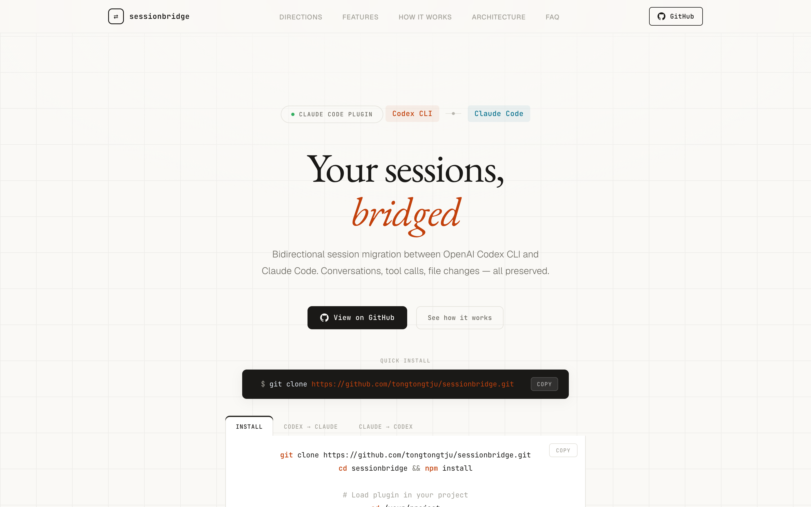

<p align="center">
  
</p>

<h1 align="center">sessionbridge</h1>

<p align="center">
  <strong>OpenAI Codex CLI ↔ Claude Code 双向会话迁移</strong>
</p>

<p align="center">
  <a href="https://tongtongtju.github.io/sessionbridge/" target="_blank">
    
  </a>
  <a href="https://github.com/tongtongtju/sessionbridge/blob/main/LICENSE">
    
  </a>
  
  
</p>

<p align="center">
  <a href="https://tongtongtju.github.io/sessionbridge/">官方网站</a> ·
  <a href="#安装">安装</a> ·
  <a href="#快速开始">快速开始</a> ·
  <a href="#命令参考">命令参考</a> ·
  <a href="#工作原理">工作原理</a> ·
  <a href="#项目结构">项目结构</a>
</p>

---

## 它能做什么？

在 **OpenAI Codex CLI** 和 **Claude Code** 之间无缝迁移开发会话——对话历史、工具调用、文件变更，全部保留。

| 方向 | 命令 | 说明 |
|------|------|------|
| Codex → Claude | `cx2cl` | 将 Codex 会话迁移到 Claude Code |
| Claude → Codex | `cl2cx` | 将 Claude Code 会话迁移到 Codex |

每个方向都支持两种模式：
- **注入模式**：将上下文摘要注入当前对话，直接接着聊
- **新会话模式**：生成完整的格式转换文件，通过 `claude -r` 或 `codex resume` 恢复

---

## 前置条件

| 依赖 | 版本要求 | 说明 |
|------|----------|------|
| **Node.js** | >= 18.0.0 | 运行插件脚本 |
| **Claude Code** | 最新版 | Anthropic 官方 CLI 工具 |
| **Codex CLI** | 任意版本 | 已有会话记录即可 |

```bash
node -v          # 检查 Node.js
claude -v        # 检查 Claude Code
ls ~/.codex/     # 检查 Codex 会话数据
```

---

## 安装

### 方式一：Claude Code 插件市场（推荐）

在 Claude Code 中执行：

```bash
# 添加插件市场源
/plugin marketplace add tongtongtju/sessionbridge

# 安装插件
/plugin install sessionbridge@sessionbridge

# 激活插件
/reload-plugins
```

安装后即可在任何项目中使用 `/sessionbridge:import-session` 命令。

### 方式二：手动安装

```bash
git clone https://github.com/tongtongtju/sessionbridge.git
cd sessionbridge
npm install
```

---

## 快速开始

### 1. 加载插件

**插件市场安装的用户：** 已自动加载，跳过此步。

**手动安装的用户：**
```bash
cd /path/to/your-project
claude --plugin-dir /path/to/sessionbridge
```

### 2. Codex → Claude（将 Codex 会话迁移到 Claude Code）

```bash
# 列出可用的 Codex 会话
/sessionbridge:import-session cx2cl --list

# 默认：注入上下文到当前会话
/sessionbridge:import-session cx2cl <codex-session-id>

# 生成新的 Claude 会话文件
/sessionbridge:import-session cx2cl <codex-session-id> --new-session
```

### 3. Claude → Codex（将 Claude 会话迁移到 Codex）

```bash
# 列出可用的 Claude 会话
/sessionbridge:import-session cl2cx --list

# 默认：生成新的 Codex 会话文件
/sessionbridge:import-session cl2cx <claude-session-id>

# 注入上下文摘要到当前对话
/sessionbridge:import-session cl2cx <claude-session-id> --inject
```

---

## 命令参考

### `cx2cl` — Codex → Claude

| 子命令 | 说明 |
|--------|------|
| `cx2cl --list` | 列出最近 20 条 Codex 会话 |
| `cx2cl <id>` | 注入 Codex 会话上下文到当前 Claude 对话（默认） |
| `cx2cl <id> --new-session` | 生成独立的 Claude Code JSONL 会话文件 |

### `cl2cx` — Claude → Codex

| 子命令 | 说明 |
|--------|------|
| `cl2cx --list` | 列出最近 20 条 Claude 会话 |
| `cl2cx <id>` | 生成独立的 Codex JSONL 会话文件（默认） |
| `cl2cx <id> --inject` | 注入 Claude 会话上下文摘要到当前对话 |

---

## 工作原理

### 整体架构

```
┌──────────────────────────────────────────────────────┐
│                    sessionbridge                      │
│                                                      │
│   Codex JSONL ←──parse──→ ParsedSession ──write──→ Claude JSONL  │
│                                                      │
│   ┌──────────────┐              ┌──────────────┐     │
│   │ codex-parser  │              │ claude-reader │    │
│   └──────┬───────┘              └──────┬───────┘    │
│          │                              │            │
│          ▼                              ▼            │
│   ┌──────────────┐              ┌──────────────┐     │
│   │claude-writer  │              │ codex-writer  │    │
│   └──────────────┘              └──────────────┘    │
│                                                      │
│   方向1: cx2cl (codex-parser → claude-writer)          │
│   方向2: cl2cx (claude-reader → codex-writer)        │
└──────────────────────────────────────────────────────┘
```

### 两种格式对比

| 维度 | Codex | Claude Code |
|------|-------|-------------|
| 存储路径 | `~/.codex/sessions/YYYY/MM/DD/rollout-*.jsonl` | `~/.claude/projects/<slug>/<uuid>.jsonl` |
| 索引 | `~/.codex/state_5.sqlite` | 无 SQLite，纯文件 |
| Session ID | UUID v7 (时间有序) | UUID v4 (随机) |
| 记录结构 | 线性流 (`session_meta`, `event_msg`, `response_item`) | DAG 链 (`uuid` + `parentUuid`) |

### 关键转换

**消息映射：**
- Codex `event_msg/user_message` ↔ Claude `type:"user"` (string content)
- Codex `response_item/message/assistant` ↔ Claude `type:"assistant"` (content blocks)
- Codex `function_call` ↔ Claude `tool_use` (工具名需映射)
- Codex `function_call_output` ↔ Claude `tool_result`

**工具名映射：**

| Codex | Claude |
|-------|--------|
| `exec_command` | `Bash` |
| `apply_patch` | `Edit` |
| `read_file` | `Read` |
| `write_file` | `Write` |
| `list_directory` | `Glob` |

**Claude → Codex 额外处理：**
- Claude 的 assistant 记录可能拆成多条（thinking/text/tool_use 分开），需要合并为一个 turn
- tool_result 在 user 记录的 content 数组里，需要通过 tool_use_id 与 tool_use 配对
- 生成 UUID v7 作为 Codex session ID
- 注册到 Codex 的 `state_5.sqlite` threads 表

---

## 项目结构

```
sessionbridge/
├── .claude-plugin/
│   └── plugin.json                   # Claude Code 插件清单
├── skills/
│   └── import-session/
│       └── SKILL.md                  # Skill 定义
├── src/
│   ├── index.ts                      # 主入口 + CLI 命令分发
│   ├── types.ts                      # 双向类型定义 + 工具名映射
│   ├── codex-parser.ts               # Codex JSONL 流式解析器
│   ├── claude-reader.ts              # Claude JSONL 流式解析器
│   ├── context-builder.ts            # 注入模式：Markdown 摘要生成
│   ├── claude-writer.ts              # Codex→Claude：JSONL 格式转换
│   ├── codex-writer.ts               # Claude→Codex：JSONL 格式转换
│   └── session-discovery.ts          # Codex 会话发现 (SQLite + 文件)
├── docs/
│   └── index.html                    # 项目介绍页
├── TECHNICAL_PLAN.md                 # 技术方案文档
├── package.json
├── tsconfig.json
└── README.md
```

---

## 常见问题

### 会话数据在哪？

- **Codex**：`~/.codex/sessions/YYYY/MM/DD/rollout-*.jsonl` + `~/.codex/state_5.sqlite`
- **Claude Code**：`~/.claude/projects/<slug>/<uuid>.jsonl`

### 会修改或删除我的原始数据吗？

**不会。** 所有操作都是只读的，只读取源会话文件，转换后的文件写入目标目录。

### 转换精度如何？

| 保留 | 丢失 |
|------|------|
| 用户消息、助手回复 | Codex 加密的推理内容 |
| 工具调用和结果 | Web 搜索结果内容 |
| 时间戳、工作目录 | 子代理结构 |
| Git 分支信息 | Hook 进度记录 |

### 支持哪些版本？

直接读写 JSONL 文件和 SQLite 数据库，不依赖 CLI 本身。只要会话数据存在就可以使用。

---

## 技术栈

- **TypeScript** (ES2022) + **Node.js** (>= 18)
- **better-sqlite3** — 读写 Codex 的 SQLite 索引
- **零编译** — `npm install` 后直接用 `tsx` 运行

---

## License

MIT
